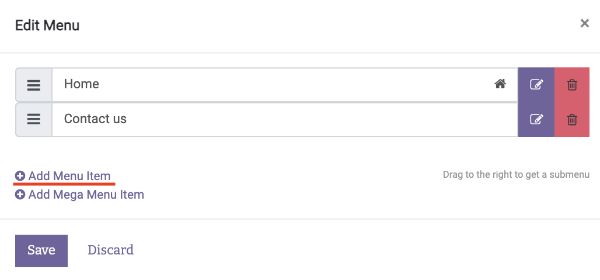

[base]: addons/base
[hr]: addons/hr
[hr_recruitment]: addons/hr_recruitment
[s2u_online_appointment]: addons/s2u_online_appointment
[website_hr_recruitment]: addons/website_hr_recruitment
[website]: [addons/website]
[website_of_s2u_online_appointment]: https://apps.odoo.com/apps/modules/14.0/s2u_online_appointment/
[reload]: scripts/reload.sh
[reset]: scripts/reset.sh
[setup]: scripts/setup.sh
[clear_container]: scripts/clear_container
[website_of_plantUML]: https://plantuml.com/en/
[website_of_docker_image]: https://hub.docker.com/_/odoo
[link_of_odoo]: http://localhost:8069

[makeUniversity]: docs/makeUniversity.md
[makeAdminUniversityAccount]: docs/makeAdminUniversityAccount.md
[makeProfessorAccount]: docs/makeProfessorAccount.md
[makeIsapProgram]: docs/makeIsapProgram.md
[signUpStudent]: docs/signUpStudent.md
[makeAppointment]: docs/makeAppointment.md
[theStructureOfIsapPlatform]: docs/theStructureOfIsapPlatform.md
[theStructureOfOdooAddons]: docs/theStructureOfOdooAddons.md
[howToUpgradeCustomAddons]: docs/howToUpgradeCustomAddons.md
[accessRulesOfThisPlatform]: docs/accessRulesOfThisPlatform.md
[howToDefineAccessRules]: docs/howToDefineAccessRules.md

# ISAP platform with odoo documents

## INDEX
- In this document
  - [Development Environment](#development-environment)
  - [Directory Explanation](#directory-explanation)
  - [How to start development](#how-to-start-development)
- How to use this system
  - [Make University (Company) instance][makeUniversity]
  - [Make Admin University Account][makeAdminUniversityAccount]
  - [Make Professor Account][makeProfessorAccount]
  - [Make ISAP Program][makeIsapProgram]
  - [Sign up as a student and apply for ISAP Program][signUpStudent]
  - [Make appointment of interview between professor and student][makeAppointment]
- Tips of development
  - [The structure of ISAP platform][theStructureOfIsapPlatform] (I recommend reading this first)
  - [The structure of odoo addons][theStructureOfOdooAddons] 
  - [How to upgrade custom addons][howToUpgradeCustomAddons]
- About access rule
  - [Access rules of this platform][accessRulesOfThisPlatform]

## Development Environment
- Windows 10 Pro
- WSL2
- Docker desktop v4.2.0
- Docker image of odoo v15.0 (IMAGE ID: 1e31bb4d7cd0)
- Docker image of postgres v13 (IMAGE ID: d3ae557d4662)
> [This][website_of_docker_image] is the site I referenced when I start up this environment  
> But, you should see [How to start development](#how-to-start-development) in this document when you start development.

## Directory explanation

### /addons

In this directory, there are custom addons. And there are two categories below,
- Installed custom addon
  - [s2u_online_appointment][s2u_online_appointment]
- Existed custom addon
  - [base][base]
  - [hr][hr]
  - [hr_recruitment][hr_recruitment]
  - [website_hr_recruitment][website_hr_recruitment]
  - [website][website]

#### Installed custom addon

This includes [s2u_online_appointment][s2u_online_appointment] addon.  
This addon is installed from [here][website_of_s2u_online_appointment] and made available in odoo v15.  
And, it is automatically mounted as a custom addon when start odoo container.

Please click [here][s2u_online_appointment] if you want to see the detail of s2u_online_appointment addon

#### Existed custom addon

This includes [base][base], [hr][hr], [hr_recruitment][hr_recruitment], [website_hr_recruitment][website_hr_recruitment], and [website][website] addons.
These addons initially exist in odoo docker container.
> you can see the source code of odoo addon in odoo container(/usr/lib/python3/dist-packages/odoo/addons)

I customized these source codes in the local environment and mounted to odoo container.
Then I copy these customized addons to source code by using [reload script][reload]

This is the way to customize existed addon. And you can see about it indetail in [here](docs/howToUpgradeCustomAddons.md).

### /config

### /scripts

### /sqls

### /uml

This directory contains the UML files described in Plant UML.
You can see [here][website_of_plantUML] if you want to know about Plant UML.

### /docs

This directory contains documents of this project as markdown files.

## How to start development
1. Install Docker Desktop and WSL by following [here](https://docs.docker.com/desktop/windows/wsl/).
  
1. set config file

2. Execute `bash setup.sh` in powershell or `./setup.sh` in WSL  
  If you modify .sh file in Windows, please execute `bash crlf_to_lf.sh` before executing .sh file.  
  This process eliminate the difference of line feed code between Windows and Linux.  
  I also made [docker-compose.yml](/docker-compose.yml). But if you setup with docker-compose.yml, you have to execute `docker start odoo` after executing docker-compose.yml
   
1. Open [localhost:8069][link_of_odoo] in browser
   
1. Enter Master Password, Database Name, Email and Password  
    
    - Master Password: Password for Database
    - Database Name: It is used when you want to login database server
    - Email: Login Email address for Administrator account
    - Password: Login Password for Administrator account

1. Execute `bash reload.sh` in powershell or `./reload.sh` in WSL
   
1. Upgrade "Base" addon
    1. Remove "Apps" tag from search bar  
          
    1. Search "Base" and Upgrade "Base" addon.  
          

1. Install "ISAP Recruitment" addon  
      

1. Making website  
    1. Choose type of Website  
   (My case: I want an elearning platform for my foreign exchange students organization business, with the main objective to schedule appointments)  
          
    1. Choose color theme
    1. Add Pages and Features and click "Build my website"  
  (My case: I didn't choose any applcations)
    1. Choose your favorite Theme  
  (My case: I chose right one)

1. Add "Programs", "Appointment" and "Portal" to menu bar
    1. Click "Pages -> Edit Menu"  
          
    1. Click add Menu Item  
          
    1. Make three manu items like these pictures below  
          
          
          

1.  Change to debug mode by entering below in url bar  
   **localhost:8069/web?debug=1**

1. Check "Free sign up" on Setting -> Permissions -> Customer Account
      
      

1. Execute `bash set_default_user.sh` in powershell or `./set_default_user.sh` in WSL

1. Execute `bash reload.sh` in powershell or `./reload.sh` in WSL again

Now, you can start developing as a Administrator.
