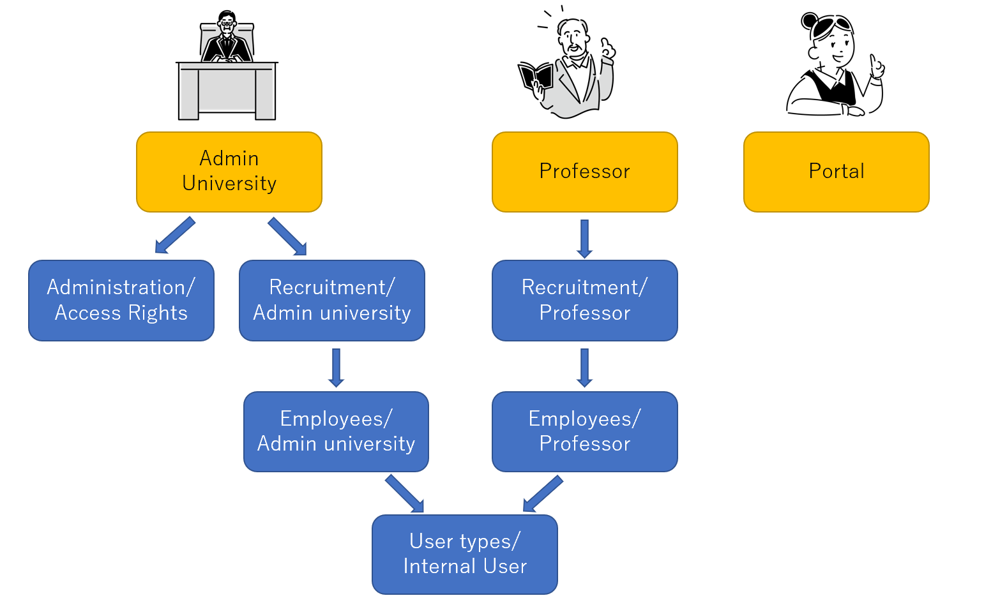

# Access rules of this platform

Please see these link below to understand how to set access right of odoo system.
 - [Document of Access Rights](https://www.odoo.com/documentation/15.0/applications/general/users/access_rights.html)

There are four types of accounts below.
1. Adoministrator (Admin of System)
2. Admin University
3. Professor
4. Portal (Student)

The picuture below is the structure of access right and groups of these type of account beside Adoministrator.  

## Admin University

The person who has right for Creating User(Professor) and access right for ISAP Recruitment addon.

> "Recruitment" in the group name is equal to "ISAP Recruitment" addon.

### Administration / Access Rights

Because of this group, users can create and edit user and edit university.  
If you want to create Administrator, you have to add "Administrator" and "Administration / Setting" group on top of "Administration / Access Rights".

### Recruitment / Admin university

Because of this group, users can manage ISAP Recruitment addon only for their own university.  
And you can also create department of university through this group.

### Employees / Admin university

This group is where define the access right of the model defined Employees(hr) addon.  
And it is inherented by "User types / Internal User".

## Professor

The person who has right for Creating ISAP Program but can't access to "Setting".

### Recruitment / Professor

Because of this groups, users can use ISAP Recruitment addon.  
But the access right fpr ISAP Recruitment addon is limited less than "Recruitment / Admin university".

### Employees / Professor

This group is where define the access right of the model defined Employees(hr) addon.  
And it is inherented by "User types / Internal User".

## Usertypes / Internal User

Because of this group, users can access the addons.  
If you don't belong to this group, you only can access to Website.

## Portal

The person who has right for appling ISAP Program. And anyone can be this User through sign up.  
But this type of user only can access to Website.