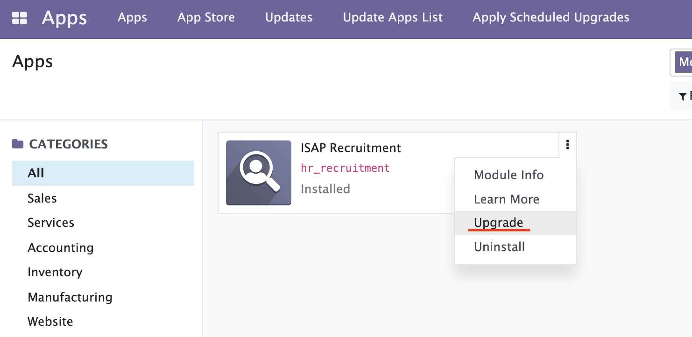
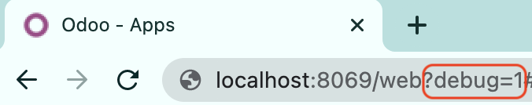
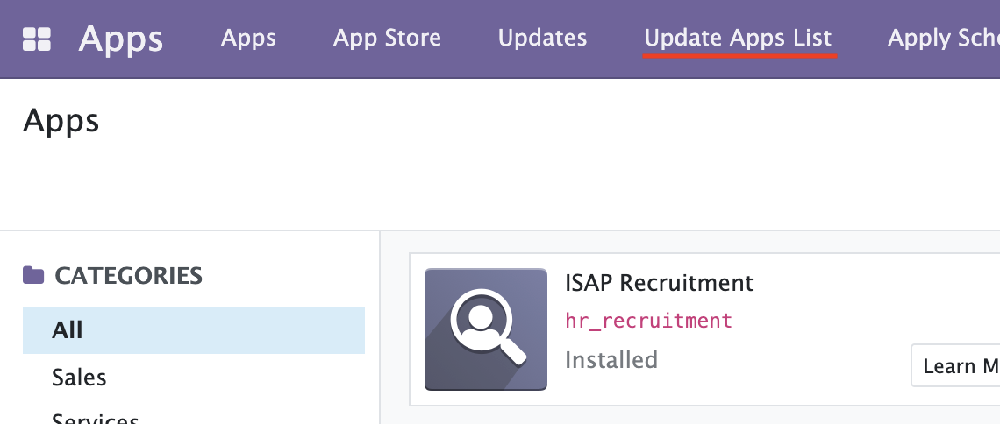
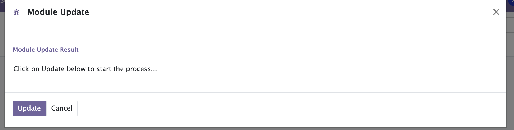

# How to upgrade custom addons

1. Customize addons under [addons directory](../addons/)

1. Execute `./isap reload`.

1. Upgrade addon you want to upgrade from App of odoo portal.  
     

If there isn't the application you want to upgrade or install, please try like below.

1. Change debug mode by adding "?debug=1" in url bar.  
     

1. Click "Update Apps List" and update.  
     
     

2. Execute `./isap reload` again.

Prev  
[The structure of odoo addons](theStructureOfOdooAddons.md)
