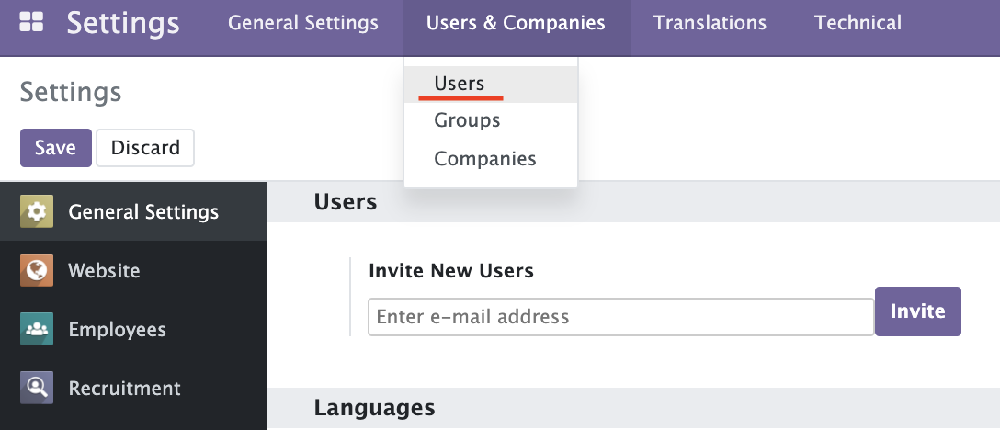
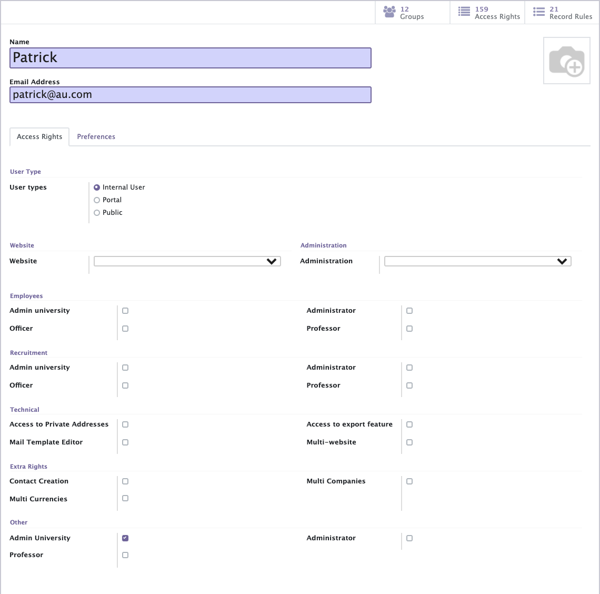
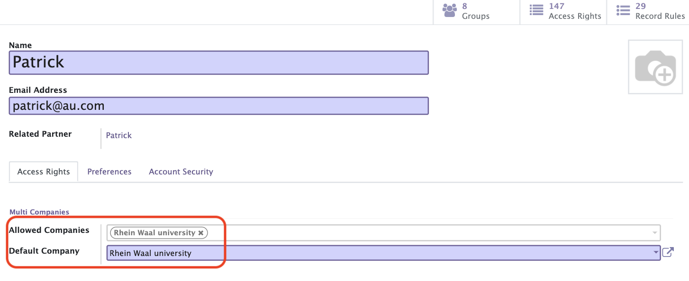
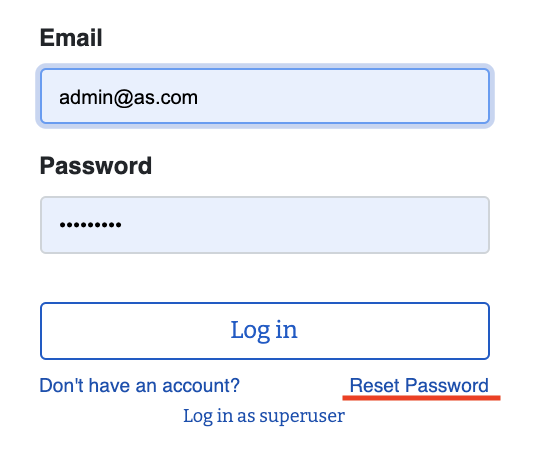
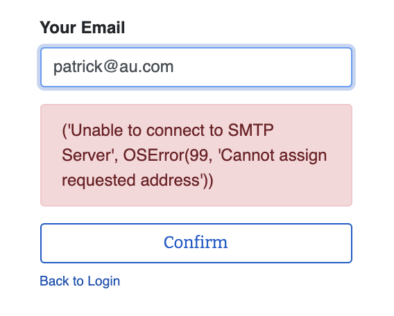
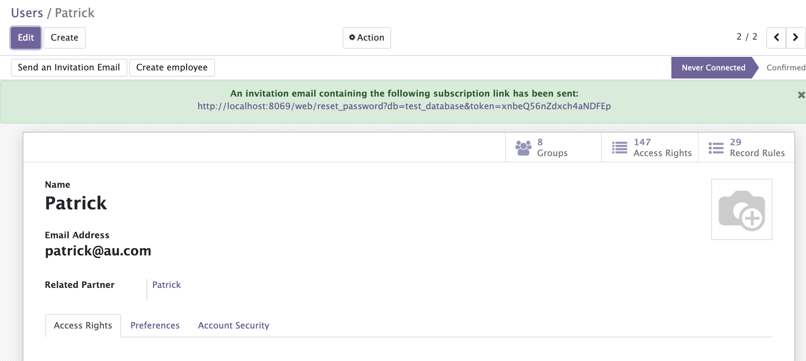
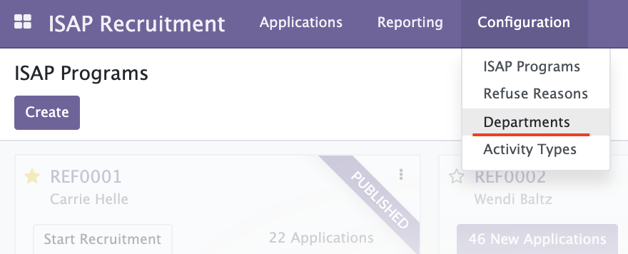
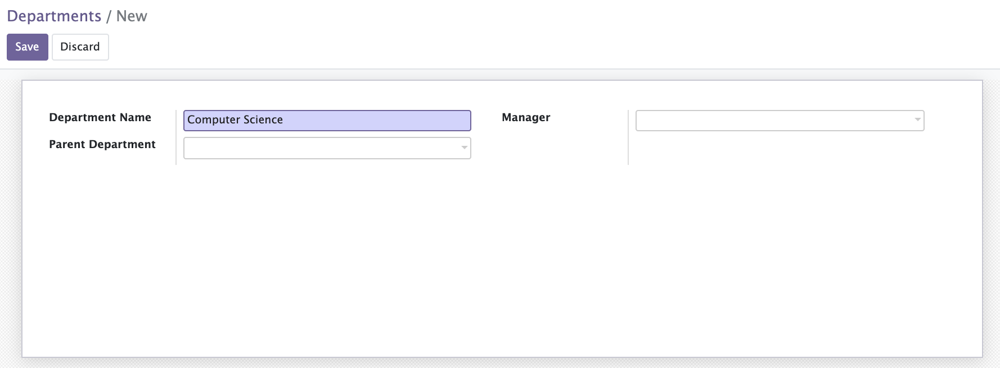

[makeUniversity]: makeUniversity.md
[makeProfessorAccount]: makeProfessorAccount.md
[how_to_start_development]: ../README.md#how-to-start-development

# Make Admin University Account

## Creation of Admin University Account
1. Click "Setting -> Users & Companies -> Users"  
   

2. Click create button and fill information of Admin University account and save.
   - Name: Name of Admin Universtiy
   - Email: Email address of Admin University
   - Access Rights
     - User Type: Internal User
     - Website: blank
     - Administration: blank
     - Employees: blank
     - Recruitment: blank
     - Technical: blank
     - Extra Rights: blank
     - Other: Admin University   
   

   After saving, appropriate access rights are filled automatically.  
   I used inherit function of groups for this. That's why I ask you to add access rights to inherit in [How to start development][how_to_start_development]

3. Click Edit button and set university made in previous document to "Allowed Companies" and "Default Company".  
   

4. Activate this account.
   1. log out from Administrator
   1. Click "Reset Password"  
        
   1. Enter the Email Address of Admin University account and press Confirm button  
   1. The Error like below picture will emerge but no probrem, please login as a Administorator  
        
   1. See the user detail of Admin University account and click the link green background  
        
   1. Enter the password and press Confirm button

## Add university departments

1. Click "ISAP Recruitment -> Configuration -> Departments"  
     
2. Press Create button and fill in Department Name and press Save button.  
     

Prev  
[Make Univerity (Company) Instance][makeUniversity]  

Next  
[Make Professor Account][makeProfessorAccount]
