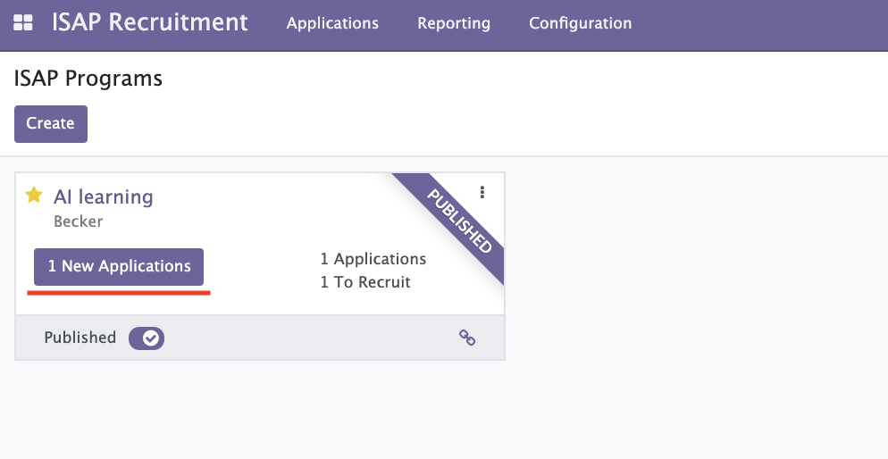
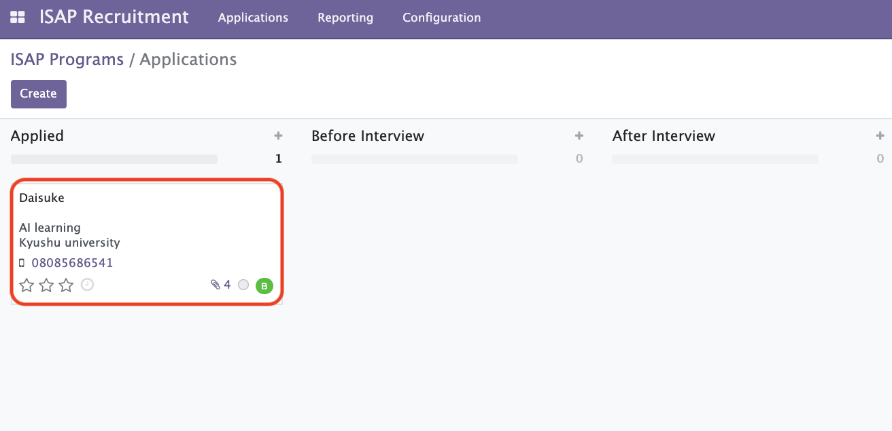
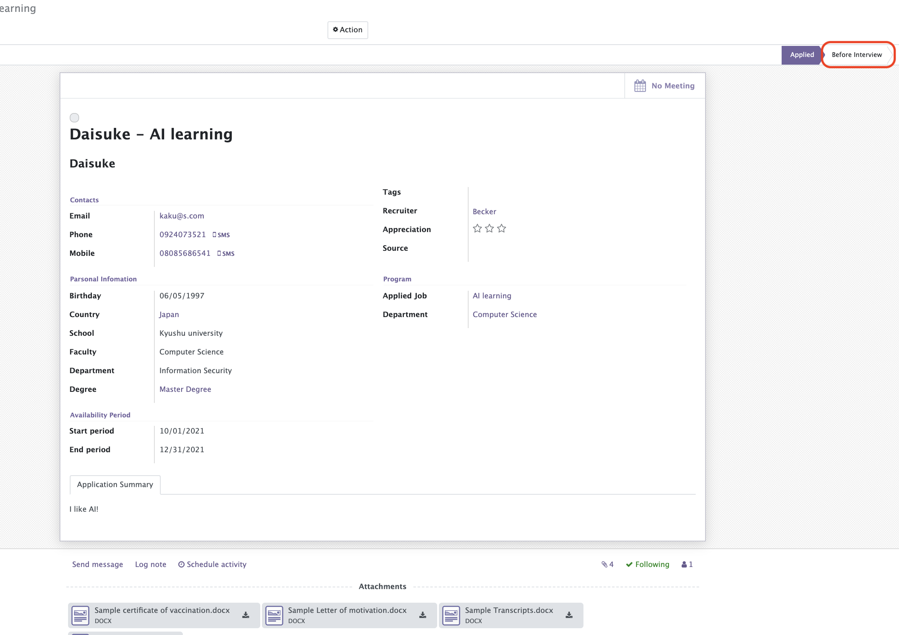
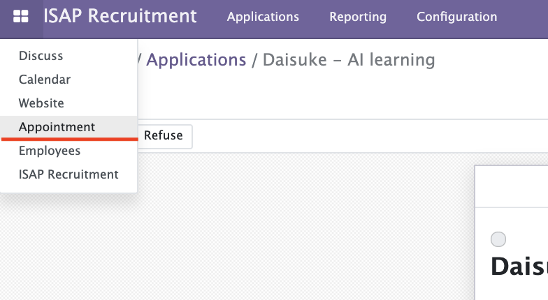
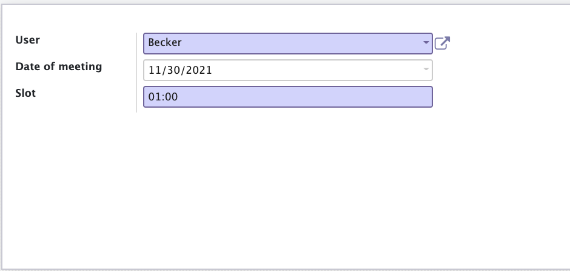
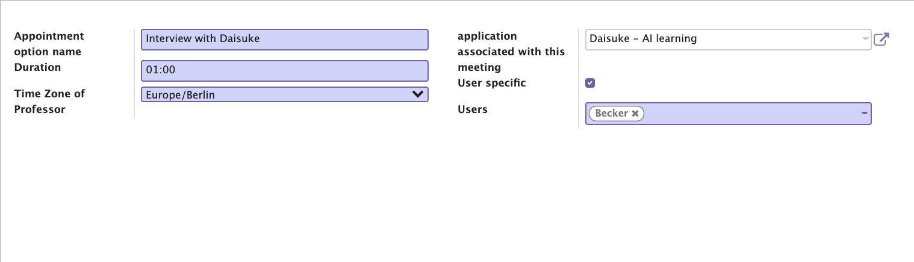
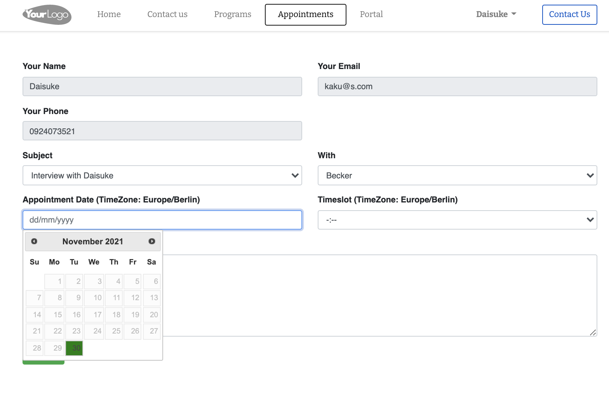
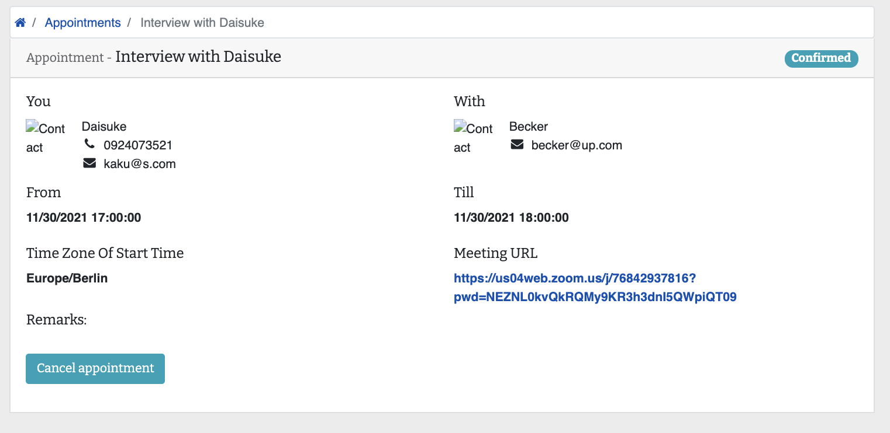
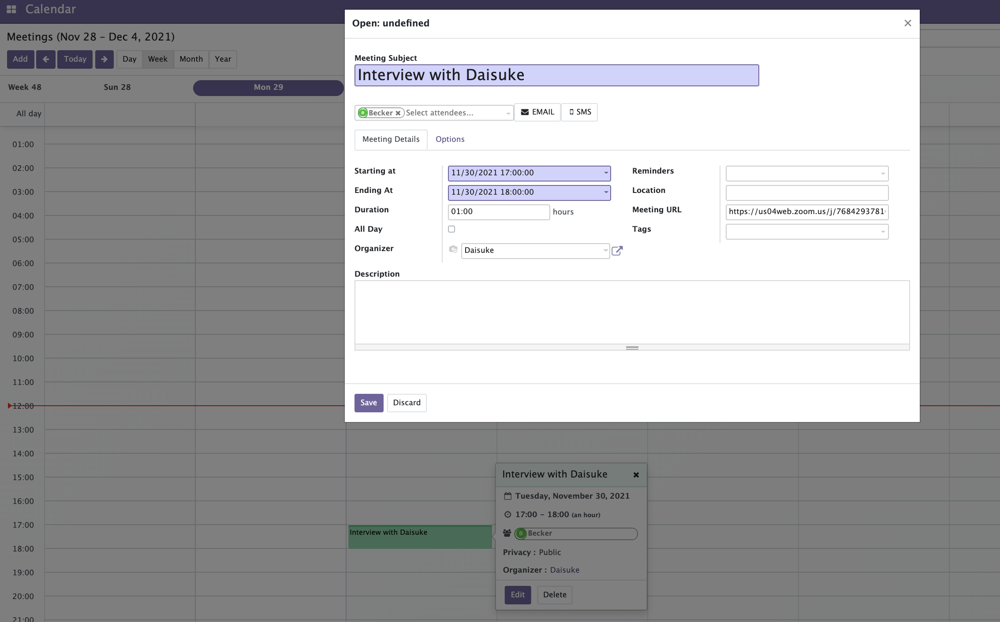

[signUpStudent]: signUpStudent.md

# Make appointment of interview between professor and student

1. Log in as a Professor Account and click "1 New Applications" in ISAP Recruitment addon.  
     

1. Click Student card.  
     

1. See the student's information. If you interested in this student, click "Before interview" state.  
     

1. Then move to "Appointment" addon.  
     

1. Create Appointment Slots.  
   Select professor name and available date and time.  
   And you can create plural slots if you want.  
     

1. Create Appointment Option.  
   Fill in information of the meeting.  
   You have to Select the Time zone of professor.  
   I guess almost meetings have time difference because this platform is for studying abroad program.  
     

1. Then login as a student and Click "Appointments" tab.   

1. Select available time for student and Click "Submit button.  
   The available dates is displayed with green color.  
   Student have to care the timeslot is for Time zone of professor region.  
     

1.  Then studnet can see the applintment from "Portal" tab -> Appointments -> [Meeting name]  
   And, the Meeting URL is automatically created by ZOOM API.  
     

1. Professor can see this appointment from "Calendar" addon.  
   And, also can see Meeting URL from here.  
     

Prev  
[Sign up as a student and apply for ISAP Program][signUpStudent]
