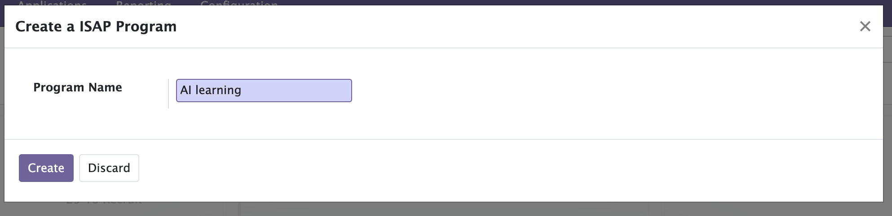
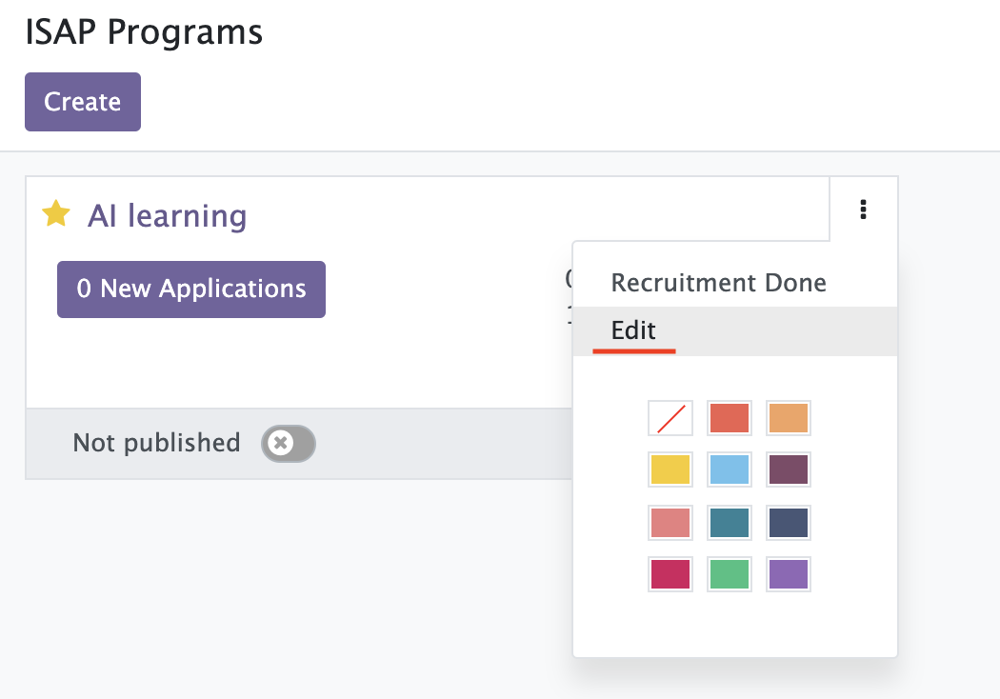
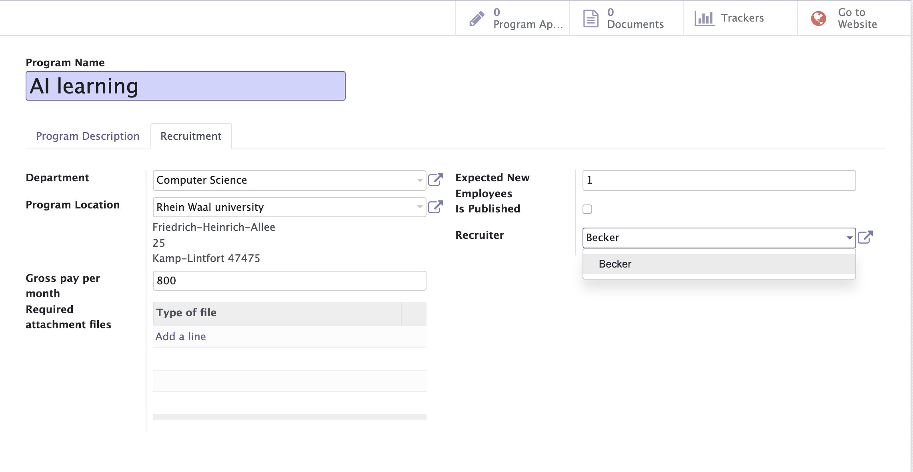
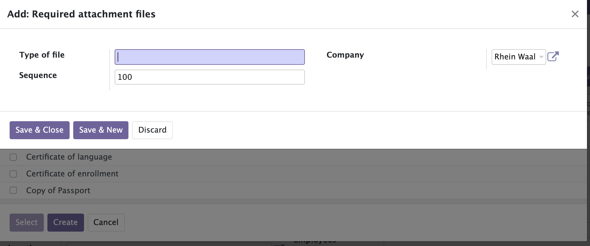
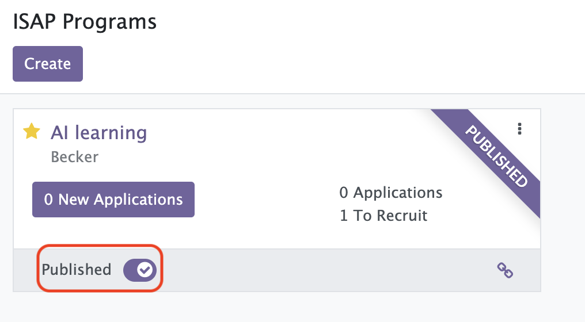

[makeProfessorAccount]: makeProfessorAccount.md
[signUpStudent]: signUpStudent.md

# Make ISAP Program

ISAP Program is made by Professor

1. Click "ISAP Recruitment" and press Create button  

2. Enter title of Program and press Create button  
   

3. Click Edit of Program  
   

4. Fill in "Program Description" and "Recruitment" and press Save button  
     
   You can select type of Required attachment files.
   And, also can create New type of Required attachment file.  
   

5. If you're ready, publish this ISAP Program  
   
   

Prev  
[Make Professor Account][makeProfessorAccount]

Next  
[Sign up as a student and apply for ISAP Program][signUpStudent]
