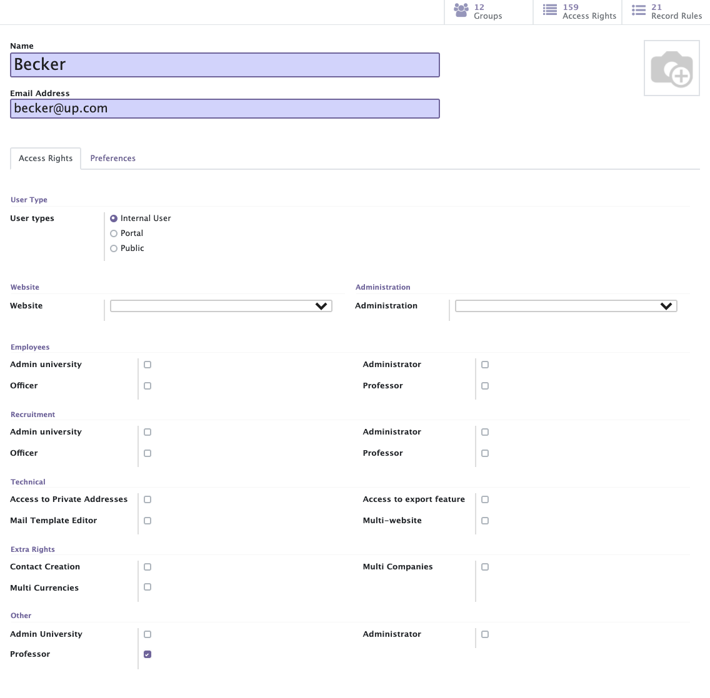
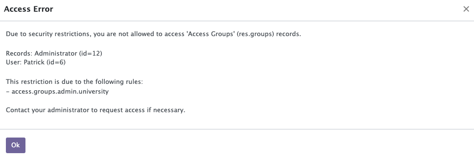

[makeAdminUniversityAccount]: makeAdminUniversityAccount.md
[makeIsapProgram]: makeIsapProgram.md

# Make Professor Account

**Professor account need to be created by Admin University account.**

1. Click Create button in "Setting -> Users & Compaies -> Users"

2. Fill information of Professor account and save.
   - Name: Name of Professor
   - Email: Email address of Professor
   - Access Rights
     - User Type: Internal User
     - Website: blank
     - Administration: blank
     - Employees: blank
     - Recruitment: blank
     - Technical: blank
     - Extra Rights: blank
     - Other: Professor   
   

   After saving, appropriate access rights are filled automatically.  
   And, you can't apply but Professor group by Admin University account. If you try, you'll refused by access rule I set.  
   

3. Activate this account with the same way with Admin Universtity account.

Prev  
[Make Admin University Account][makeAdminUniversityAccount]

Next  
[Make ISAP Program][makeIsapProgram]
