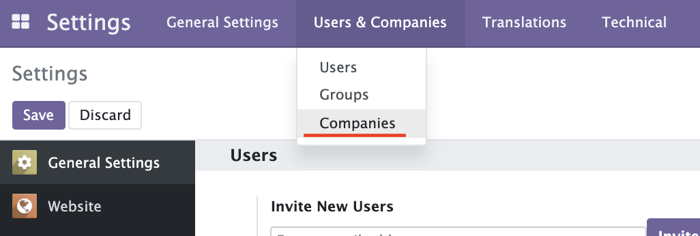
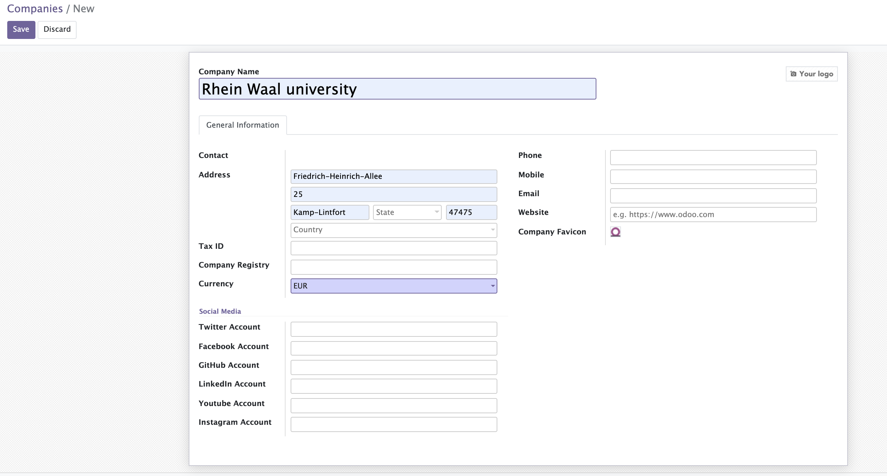

[makeAdminUniversityAccount]: makeAdminUniversityAccount.md
# Make University (Company) Instance

The creation of University instance is allowed only by Administorator.  
But, Admin University account can Edit the information of University.

## Creation of University instance

1. The university instance is made with Company model. So, you can create university instance from  
    "Setting -> Users & Companies -> Companies"
    

2. Click Create button  
   

3. Fill Information of University and save.  
   

Next  
[Make Admin University Account][makeAdminUniversityAccount]
