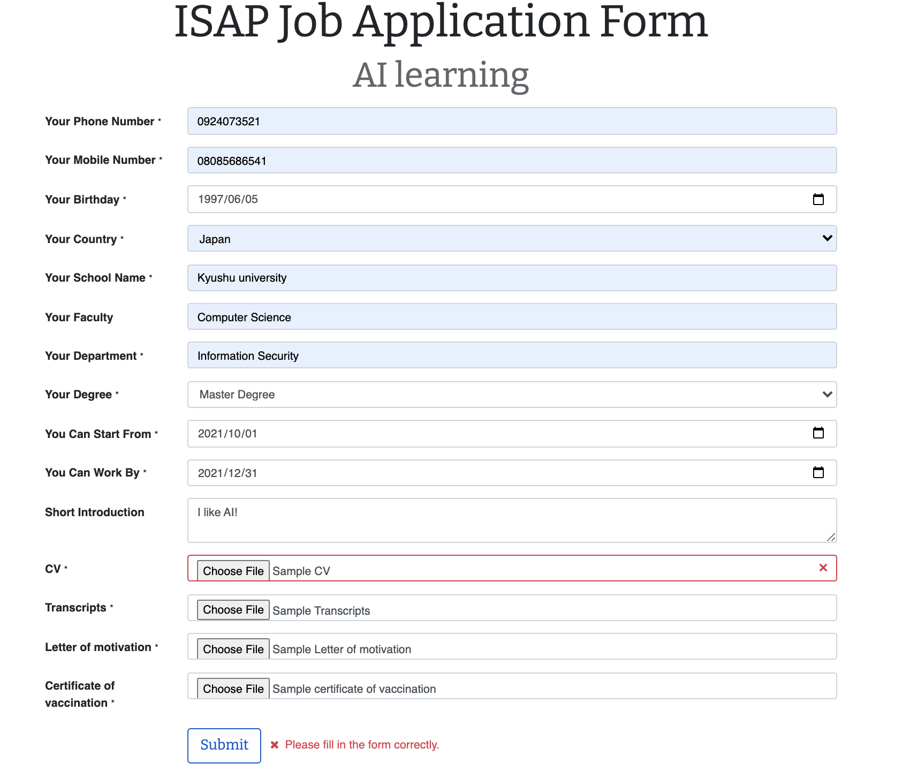

[makeIsapProgram]: makeIsapProgram.md
[makeAppointment]: makeAppointment.md

# Sign up as a student and apply for ISAP Program

## Sign up as a student

1. Click "Don't have an account?" at login page.  
     

2. Fill in information and Click "Sign up" button.  
    Email and Name are also used when you apply for ISAP Program.  
      

## Apply for ISAP Program

1. Move to "Programs" tab.  
     

2. Choose Program you want to apply.  
     

4. Click "Apply Now!" button.  
     

5. Fill in the information form and click "Submit" button.  
   You have to subimt the require files and can't be empty.  
     

6. If you can see this page, the application got succeeded.  
     

And you can see your current application stage from Your Applications  
  

Prev  
[Make ISAP Program][makeIsapProgram]

Next  
[Make appointment of interview between professor and student][makeAppointment]
