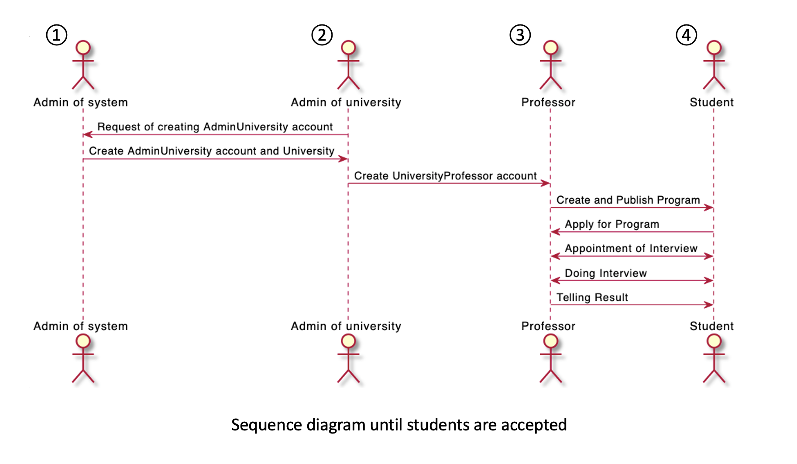
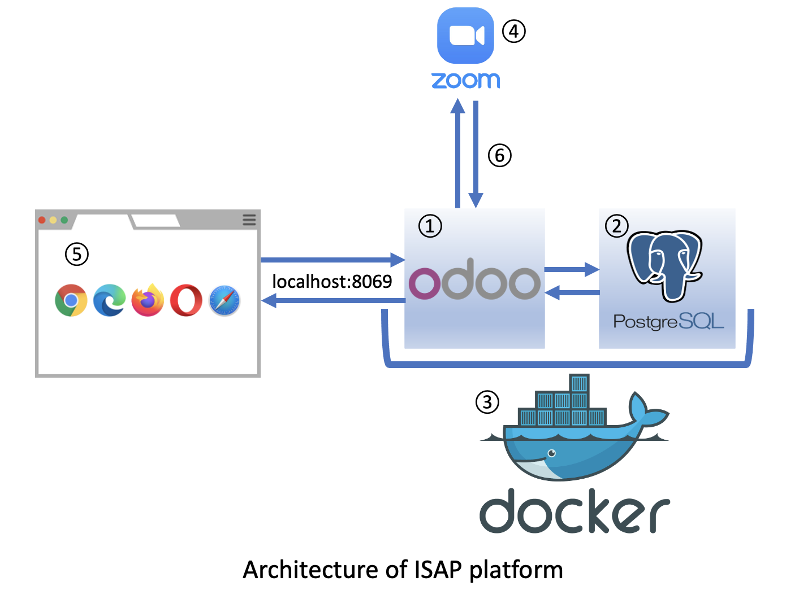
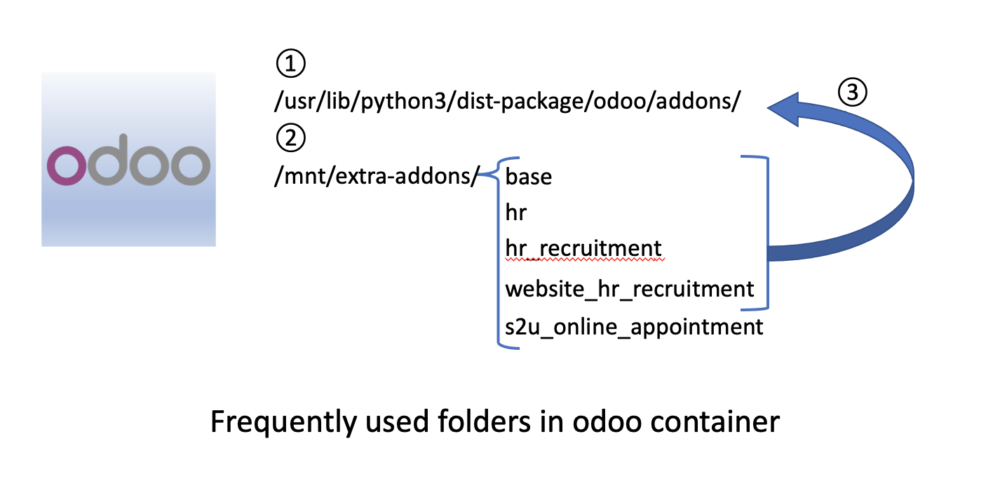

[odoo_app_store]: https://apps.odoo.com/apps
[setup]: ../setup
[web_of_docker]: docker.com/products/docker-desktop
[zoom_developer]: https://developers.zoom.us/
[zoom_api_document]: https://marketplace.zoom.us/docs/api-reference/zoom-api/meetings/meetingcreate

# The structure of ISAP platform

## Sequence until studensts are acceppted
This is the sequence diagram that show sequence until students are acceppted.  
  
Now, start to description of user type.  

1. **Admin of system**  
    This type have all access right to manage this system. And, have the right to make Admin of university account. This type was made with the expection of having only one account.

1. **Admin of university**  
   This type have the right to make Professor account and edit information of university. This type was made with the expection of having one account per university.

1. **Professor**  
   This type have the right to make ISAP program and make appointment of interview with Student account. But, this type doesn't have right access to setting of odoo.

1. **Student**  
   This type have the right to signup ISAP platform, apply for ISAP program and make appointment of interview with Professor account.


## Architecture of ISAP platform
This is the architecture of ISAP platform.
  

1. **odoo container**  
   It is the docker container made from docker image of odoo v15.0 (IMAGE ID: 1e31bb4d7cd0)  
   This container can be made by the command of below in [setup][setup].
   ```
   docker run -v <path to isap_platform>/addons:/mnt/extra-addons -p 8069:8069 --name odoo --link db:db -t odoo
   ```  
   In the part of `-v <path to isap_platform>/addons:/mnt/extra-addons`, you can mount your developing folder into odoo container.

   In the part of `-p 8069:8069`, you can connect the port of 8069 of odoo container with the port of local computer. Then you can see odoo service with web browser.

   And, you can enter into this container by the command of below.  
   ```
   docker exec -it -u 0 odoo bash
   ```

1. **PostgreSQL container**  
   It is the docker container made from docker image of postgres v13 (IMAGE ID: d3ae557d4662)  
   This container can be made by the command of below in [setup][setup].
   ```
   docker run -d -e POSTGRES_USER=odoo -e POSTGRES_PASSWORD=odoo -e POSTGRES_DB=postgres --name db postgres:13
   ```

   And, you can enter into this container by the command of below.  
   ```
   docker exec -it -u 0 odoo bash
   ```

1. **docker**  
   The base for executing docker container.  
   You can install from [here][web_of_docker].  

1. **ZOOM API**  
   The API is used when user create meeting url. we have to register developer account of zoom (nothing of charge).  
   - [Zoom developer account][zoom_developer]
   - [Zoom API document (about creating meeting)][zoom_api_document]

1. **browser**  
   You can see the odoo system from browser at [localhost:8069](http://localhost:8069).

1. **communication part between ZOOM API and odoo container**  
   The python code is executed when system make appointment.  
   The codes of ZOOM API is from line 160 of [/addons/s2u_online_appointment_controllers/main.py](../addons/s2u_online_appointment/controllers/main.py).


## Frequently used folders in odoo container
This is the frequently used folders in odoo container.  
This is related with how I customized existed addons and how I used the custom addons from [odoo app store][odoo_app_store].  
  

1. In this directory, there are source codes of odoo addons. The addons are executed by these source codes.

1. In this directory, there are codes in [isap_platform/addons](../addons) mounted by the command of below.
   ```
   docker run -v ~/Desktop/odoo/isap_platform/addons:/mnt/extra-addons -p 8069:8069 --name odoo --link db:db -t odoo
   ```

1. Now, the addons "base", "hr", "hr_recruitment" and "website_hr_recruitment" exist in the both of /usr/lib/python3/dist-package/odoo/addons/ and /mnt/extra-addons/  
   In that case, the addons in /usr/lib/python3/dist-package/odoo/addons/ are executed. So we have to overwrite to customized addons.
   Then, the commands of below in [reload](../reload) is used for that.
   ```
   docker exec -it -u 0 odoo cp -r /mnt/extra-addons/base/ /mnt/extra-addons/hr_recruitment/ /mnt/extra-addons/website_hr_recruitment/ /mnt/extra-addons/hr/ /usr/lib/python3/dist-packages/odoo/addons/
   ```  


Next  
[The structure of odoo addons](theStructureOfOdooAddons.md)  
