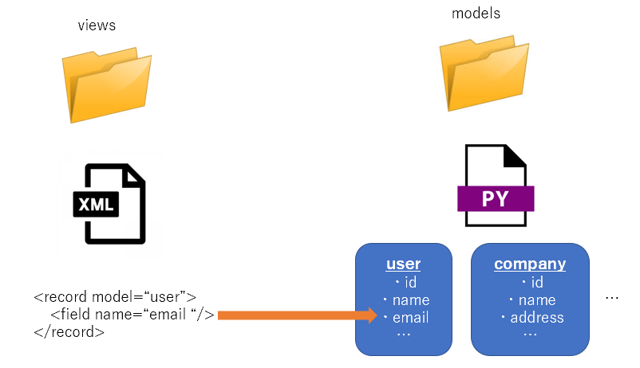

# The structure of odoo addons

## The basic flow of development

1. Create or Modify model under models directory

1. Refer to the value of the model from the xml file under views directory using \<record>, \<field>, \<t> etc

## \_\_manifest\_\_.py

> The manifest file serves to declare a python package as an Odoo module and to specify module meta data.  

The documentation is [here](https://www.odoo.com/documentation/15.0/developer/reference/backend/module.html)  

## models/

The place where modify the odoo model in python file.  
The documentation of model is [here](https://www.odoo.com/documentation/15.0/developer/reference/backend/orm.html)

## views/

The place where modify front end in xml file.  

If you want to modify the view of Internal part (like create page of ISAP program, View page of Student application), you need to learn about **\<recode>** and **\<field>** tags. The documentation is [here](https://www.odoo.com/documentation/15.0/developer/reference/backend/views.html#).  

If you want to modify the website page (like application page for ISAP program), you need to learn about **\<t>** tag and t field in addition to **\<recode>** and **\<field>** tags. The documentation is [here](https://www.odoo.com/documentation/15.0/developer/reference/frontend/qweb.html).

## data/

The place where write data to install when you set up isap system(execute ./setup.sh).

## security/

The place where set access right.  
How to set access right is written in [here](howToDefineAccessRules.md).

Prev  
[The structure of ISAP platform](theStructureOfIsapPlatform.md)  

Next  
[How to upgrade custom addons](howToUpgradeCustomAddons.md)
